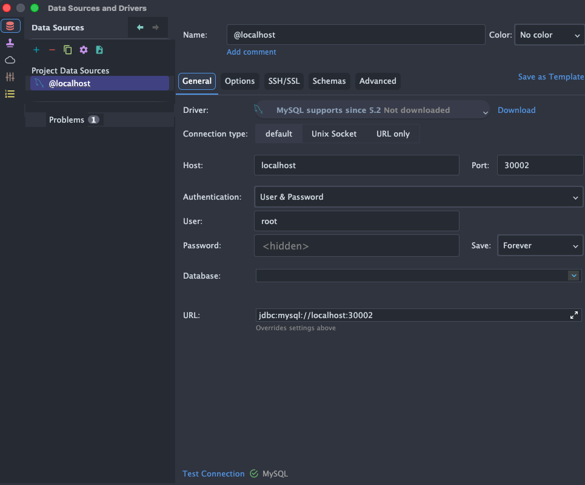

```shell
# secret 생성
$ kubectl apply -f mysql-secrete.yaml
secret/mysql-secret created

# config map 생성
$ kubectl apply -f mysql-config.yaml
configmap/mysql-config created

# deployment 생성
$ kubectl apply -f mysql-deployment.yaml
deployment.apps/mysql-deployment created

# service 생성
$ kubectl apply -f mysql-service.yaml
service/mysql-service created
```



<br>

> [!TIP]
> `mysql-pv.yaml`, `mysql-pvc.yaml` 작성 후
```shell
# pv 생성
$ kubectl apply -f mysql-pv.yaml

# pvc 생성
$ kubectl apply -f mysql-pvc.yaml

# deployment 재설정
$ kubectl apply -f mysql-deployment.yaml
```

<br>

> [!NOTE]
> deployment를 재시작해도 mysql 내부에 새로 생성한 database(스키마)가 삭제되지 않고 남아 있는다.
```shell
$ kubectl rollout restart deployment mysql-deployment
deployment.apps/mysql-deployment restarted

$ kubectl get pods
NAME                                 READY   STATUS    RESTARTS      AGE
mysql-deployment-966974c7f-x7qmz     1/1     Running   1 (10s ago)   13s
spring-deployment-76f69bcd78-2xn8x   1/1     Running   0             3h53m
spring-deployment-76f69bcd78-fj666   1/1     Running   0             3h53m
spring-deployment-76f69bcd78-xqjn2   1/1     Running   0             3h53m
```