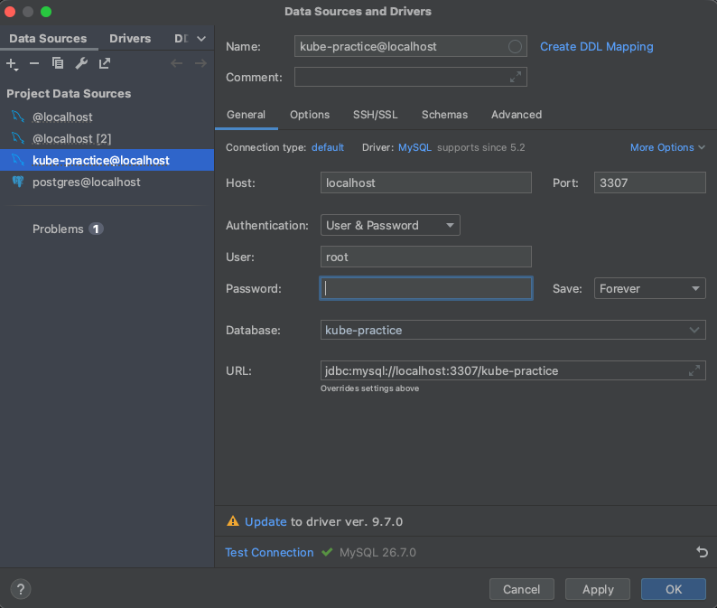

```shell
# secret 생성
$ kubectl apply -f mysql-secrete.yaml
secret/mysql-secret created

# config map 생성
$ kubectl apply -f mysql-config.yaml
configmap/mysql-config created

# deployment 생성
$ kubectl apply -f mysql-deployment.yaml
deployment.apps/mysql-deployment created

# service 생성
$ kubectl apply -f mysql-service.yaml
service/mysql-service created
```


<br>

> [!TIP]
> `mysql-pv.yaml`, `mysql-pvc.yaml` 작성 후
```shell
# pv 생성
$ kubectl apply -f mysql-pv.yaml

# pvc 생성
$ kubectl apply -f mysql-pvc.yaml

# deployment 재설정
$ kubectl apply -f mysql-deployment.yaml
```

<br>

> [!NOTE]
> deployment를 재시작해도 mysql 내부에 새로 생성한 database(스키마)가 삭제되지 않고 남아 있는다.
```shell
$ kubectl rollout restart deployment mysql-deployment
deployment.apps/mysql-deployment restarted

$ kubectl get pods
NAME                                 READY   STATUS    RESTARTS      AGE
mysql-deployment-966974c7f-x7qmz     1/1     Running   1 (10s ago)   13s
spring-deployment-76f69bcd78-2xn8x   1/1     Running   0             3h53m
spring-deployment-76f69bcd78-fj666   1/1     Running   0             3h53m
spring-deployment-76f69bcd78-xqjn2   1/1     Running   0             3h53m
```

<br>

### ✅ Cluster IP 설정 후
```shell
# mysql-service 설정
$ kubectl apply -f mysql-service.yaml
service/mysql-service created

# 여기 MySQL에 접속하고 있는 Spring Boot Deployment가 있다면 재시작
$ kubectl rollout restart deployment spring-deployment
deployment.apps/spring-deployment restarted

# pods 목록 출력
$ kubectl get pods
NAME                                 READY   STATUS    RESTARTS      AGE
mysql-deployment-84d878f88d-szkxh    1/1     Running   1 (55m ago)   56m
spring-deployment-5dddf4fbc8-kt5np   1/1     Running   0             101s
spring-deployment-5dddf4fbc8-qt8pv   1/1     Running   0             103s
spring-deployment-5dddf4fbc8-tckfh   1/1     Running   0             102s
```

<br>

### ✅ 로컬에서는 DB에 접속 가능하도록 포트 포워딩
```shell
# 파드명이 mysql-deployment-84d878f88d-szkxh
# 위의 커맨드 (kubectl get pods)로 확인
$ kubectl port-forward pod/mysql-deployment-84d878f88d-szkxh 3307:3306
Forwarding from 127.0.0.1:3307 -> 3306
Forwarding from [::1]:3307 -> 3306
```
> [!TIP]
> 나의 경우에는 3306을 이미 쓰고 있어서 3307로 포트를 바꿔서 테스트했다.

