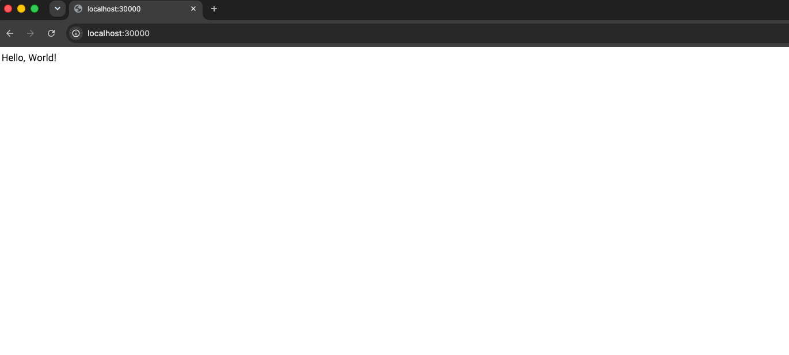
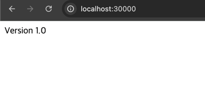

## 서버 3개 띄우기
> [!NOTE]
> `spring-pod.yaml`에 `name`만 다르게 해서 3개의 설정을 `---`을 구분선으로 작성 후 아래와 같은 명령어를 입력한다.

```shell
# 쿠버네티스 실행
$ kubectl apply -f spring-deployment.yaml
pod/spring-pod-1 created
pod/spring-pod-2 created
pod/spring-pod-3 created

# Pod 리스트 출력
$ kubectl get pods
NAME           READY   STATUS    RESTARTS   AGE
spring-pod-1   1/1     Running   0          3m38s
spring-pod-2   1/1     Running   0          3m38s
spring-pod-3   1/1     Running   0          3m38s

# Pod 하나하나 지우기
$ kubectl delete pod spring-pod-1
$ kubectl delete pod spring-pod-2
$ kubectl delete pod spring-pod-3
```

<br>

## Deployment 활용

> [!TIP]
> manifest 파일 명은 중요하지 않다.(`spring-pod.yaml` ➡ `spring-deployment.yaml`)

```shell
# deployment 실행
$ kubectl apply -f spring-deployment.yaml
deployment.apps/spring-deployment created

# deployment 확인
$ kubectl get deployment
NAME                READY   UP-TO-DATE   AVAILABLE   AGE
spring-deployment   3/3     3            3           67s

# replicaset 확인
$ kubectl get replicaset
NAME                           DESIRED   CURRENT   READY   AGE
spring-deployment-77fb8d465f   3         3         3       103s

# pods 확인
$ kubectl get pods
NAME                                 READY   STATUS    RESTARTS   AGE
spring-deployment-77fb8d465f-4wzhd   1/1     Running   0          2m
spring-deployment-77fb8d465f-cps2h   1/1     Running   0          2m
spring-deployment-77fb8d465f-q8ns6   1/1     Running   0          2m
```

## Service
```shell
$ kubectl apply -f spring-service.yaml
service/spring-service created

$ kubectl get service
NAME             TYPE        CLUSTER-IP      EXTERNAL-IP   PORT(S)          AGE
kubernetes       ClusterIP   10.96.0.1       <none>        443/TCP          43d
spring-service   NodePort    10.97.194.183   <none>        8080:30000/TCP   9s
```


### Self Healing
```shell
# 컨테이너가 5개 띄어져 있는 상황
$ docker ps
CONTAINER ID   IMAGE          COMMAND                CREATED              STATUS              PORTS     NAMES
b7e152ab4d41   17de0fe96f72   "java -jar /app.jar"   About a minute ago   Up About a minute             k8s_spring-container_spring-deployment-77fb8d465f-bsh9z_default_c93d2667-4717-42bb-add5-f50744eaa66a_0
5e69d7de6460   17de0fe96f72   "java -jar /app.jar"   About a minute ago   Up About a minute             k8s_spring-container_spring-deployment-77fb8d465f-kq8s6_default_a38d0051-7c1c-4dc9-9676-eb0179a45a09_0
7489ed141421   17de0fe96f72   "java -jar /app.jar"   21 minutes ago       Up 21 minutes                 k8s_spring-container_spring-deployment-77fb8d465f-q8ns6_default_53b9e467-f987-4b30-96b6-5ae0397e77ac_0
355875f6f25b   17de0fe96f72   "java -jar /app.jar"   21 minutes ago       Up 21 minutes                 k8s_spring-container_spring-deployment-77fb8d465f-4wzhd_default_4c7b7ae8-a94f-40cf-93ab-f7d4399b9308_0
36889d9672b6   17de0fe96f72   "java -jar /app.jar"   21 minutes ago       Up 21 minutes                 k8s_spring-container_spring-deployment-77fb8d465f-cps2h_default_6f3669bc-1007-4528-91da-fc5b13de31fc_0

# 하나의 컨테이너를 죽인다.
$ docker kill b7e152ab4d41
b7e152ab4d41

# 컨테이너가 자동으로 restart된 것을 확인할 수 있다.
$ kubectl get pods
NAME                                 READY   STATUS    RESTARTS      AGE
spring-deployment-77fb8d465f-4wzhd   1/1     Running   0             22m
spring-deployment-77fb8d465f-bsh9z   1/1     Running   1 (21s ago)   100s
spring-deployment-77fb8d465f-cps2h   1/1     Running   0             22m
spring-deployment-77fb8d465f-kq8s6   1/1     Running   0             100s
spring-deployment-77fb8d465f-q8ns6   1/1     Running   0             22m
```

<br>

## 새로운 버전의 서버로 업데이트 시키기

> [!NOTE]
> 먼저 서버 코드를 변경시킨다.

```shell
# Spring 서버 빌드
$ ./gradlew clean build
Java HotSpot(TM) 64-Bit Server VM warning: Sharing is only supported for boot loader classes because bootstrap classpath has been appended

BUILD SUCCESSFUL in 3s
8 actionable tasks: 8 executed
Consider enabling configuration cache to speed up this build: https://docs.gradle.org/9.5.1/userguide/configuration_cache_enabling.html

# Docker Image 빌드
$ docker build -t spring-server:1.0 .

# image 생성 잘 됐는지 확인
$ docker image ls
IMAGE               ID             DISK USAGE   CONTENT SIZE   EXTRA
spring-server:1.0   df34cd288bf6        529MB             0B

# spring-deployment.yaml에 `image: spring-server:1.0`로 변경 후 실행 
$ kubectl apply -f spring-deployment.yaml
deployment.apps/spring-deployment configured  

$ kubectl get pods
NAME                                 READY   STATUS    RESTARTS   AGE
spring-deployment-5d6cc49766-bggrw   1/1     Running   0          13s
spring-deployment-5d6cc49766-m4tkp   1/1     Running   0          14s
spring-deployment-5d6cc49766-xz26t   1/1     Running   0          12s
```




```shell
# 이전에 띄어놓은 쿠버네티스 deploy나 service 등 삭제
$ kubectl delete all --all

# pod 조회
$  kubectl get pods
No resources found in default namespace.

# service 조회
$ kubectl get service
NAME         TYPE        CLUSTER-IP   EXTERNAL-IP   PORT(S)   AGE
kubernetes   ClusterIP   10.96.0.1    <none>        443/TCP   72m

# deployment 조회
$ kubectl get deployment
No resources found in default namespace.
```