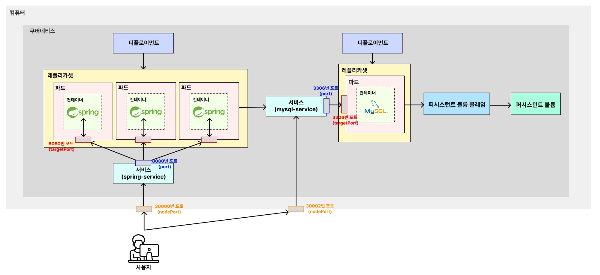

> [!CAUTION]
> mysql-service 이름의 서비스와 그와 관련된 오브젝트들이 띄어진 상태에서 진행해야 연결 및 실행된다.



```shell
# 기존에 이미 같은 이름의 deployment가 존재한다면 아래와 같이 삭제
$ kubectl delete deployment spring-deployment
deployment.apps "spring-deployment" deleted from default namespace

# 기존에 이미 같은 이름의 service가 존재한다면 아래와 같이 삭제
$ kubectl delete service spring-service
service "spring-service" deleted from default namespace

$ kubectl apply -f spring-deployment.yaml
deployment.apps/spring-deployment created

$ kubectl apply -f spring-service.yaml
service/spring-service created
```